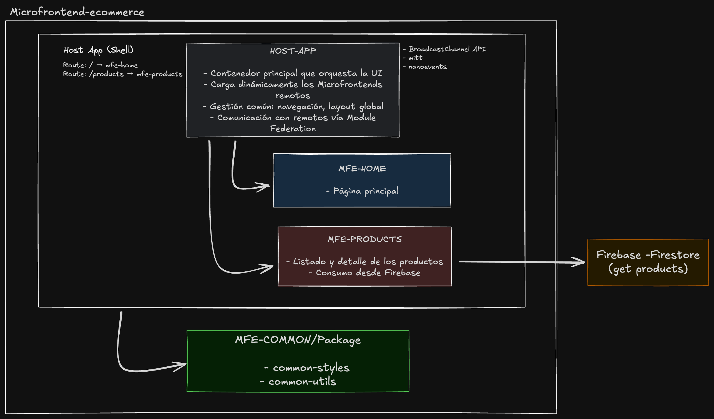

# 🛒 Microfrontend E-commerce

Este es un proyecto modular de e-commerce implementado con **Microfrontends**, utilizando **React**, **Module Federation**, **Vite**, **Docker**, y **Bun** como gestor de paquetes. El proyecto sigue una arquitectura multirepo, con un host que orquesta múltiples aplicaciones remotas (MFEs).

---

### 🧩 Arquitectura general



## 📁 Estructura del Proyecto

<pre>
/MICROFRONTEND-ECOMMERCE
├── common/
│ └── packages/
│ ├── common-styles/ # Estilos reutilizables (styled-components)
│ └── common-utils/ # Funciones utilitarias compartidas
├── mfe-home/
│ └── Dockerfile # MFE de inicio (landing)
├── mfe-products/
│ └── Dockerfile # MFE que consume Firebase para listar productos
├── host-app/
│ └── Dockerfile # App Host (Shell) que integra los MFEs
└── docker-compose.yml # Orquestación del entorno local con Docker
</pre>

---

## 🚀 Tecnologías

- **React + Vite**: base de los MFEs
- **Module Federation**: integración de microfrontends
- **Firebase**: backend para productos
- **Bun**: gestor de paquetes ultrarrápido
- **Docker**: contenedores para cada app
- **styled-components**: para estilos reutilizables
- **pnpm o bun link**: para compartir paquetes entre MFEs

---

## 🧭 Rutas

- `/` → carga `mfe-home`
- `/products` → carga `mfe-products`

La navegación se maneja desde el `host-app`, que redirige a las aplicaciones remotas correspondientes usando **react-router-dom** y **Module Federation**.

El enrutamiento se maneja desde el `host-app`:

| Ruta        | Descripción                     | MFE cargado    |
| ----------- | ------------------------------- | -------------- |
| `/`         | Página de inicio                | `mfe-home`     |
| `/products` | Listado de productos (Firebase) | `mfe-products` |

---

## 🔄 Comunicación entre MFEs

- Se usa **Module Federation** para exponer componentes de los MFEs.
- Los MFEs comparten lógica y estilos a través de los paquetes `common-utils` y `common-styles`.
- El `host-app` maneja el enrutamiento y la carga dinámica de cada MFE.
- Comunicación entre MFEs vía props, contextos compartidos o eventos personalizados (según el caso).

La comunicación y el estado global se maneja a través de:

- Paquete `common-utils`: funciones y contextos compartidos
- Patrón de **prop drilling o context forwarding** según el caso
- Cada MFE importar lógica común usando `bun link`

---

## 📦 Variables de Entorno

Cada MFE puede tener un `.env.preview` para variables como claves de Firebase:

```env
# ejemplo en mfe-products/.env.preview
VITE_FIREBASE_API_KEY=your_key
VITE_FIREBASE_PROJECT_ID=your_project_id
```

Se cargan desde el `docker-compose.yml`:

```yml
services:
  mfe-products:
    env_file:
      - ./mfe-products/.env.preview
```

Y en `Vite` se usa así:

```ts
define: {
  'process.env': {
    VITE_FIREBASE_API_KEY: process.env.VITE_FIREBASE_API_KEY,
    VITE_FIREBASE_PROJECT_ID: process.env.VITE_FIREBASE_PROJECT_ID,
  },
}
```
